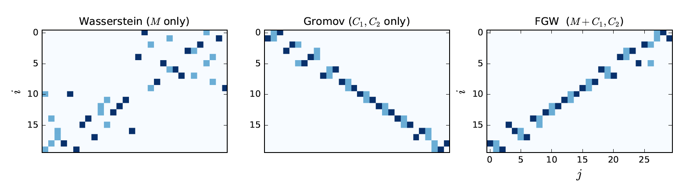
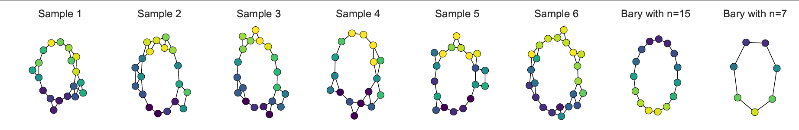

# FGW

Python3 implementation of the paper [Optimal Transport for structured data with application on graphs
](https://arxiv.org/abs/1805.09114) 

Fused Gromov-Wasserstein (FGW) is a distance between labeled graphs based on Optimal Transport. It is applicable between graphs with different number of nodes and with any type of label/feature on the nodes. 

It computes a soft assignment of the nodes wrt their features and the graphs' structures. It can be used for visualisation, classification and barycenter of multiple graphs.

In the paper we also used this implementation of the Patchy-San Convolutional Network framework [PSCN](https://github.com/tvayer/PSCN)

Feel free to ask if any question

### Prerequisites

* For graph tools [networkx](https://networkx.github.io/) Networkx (>=2.0)
* For the classification using Graph Kernels using [GraKel](https://ysig.github.io/GraKeL/dev/) GraKel (>=0.1a5) 
* For Optimal transport [Python Optimal Transport](https://pot.readthedocs.io/en/stable/) POT (>=0.5.1)
* Sklearn (>=0.20.0)
* Numpy (>=1.11)
* Scipy (>=1.0)
* Cython (>=0.23)
* Matplotlib (>=1.5)

### Data 

All the data used in the paper came from the Benchmark Data Sets for Graph Kernels [3]

### What is included ?

* FGW between structured objects with a cost M between features and structure matrices C1,C2:



* Comparing labeled graphs using FGW:

<p align="center">
  
</p>

* Methods for graphs barycenter using FGW:



* Nested cross validation used in the paper (for e.g):

```
python3 nested_cv_fgw.py -dn mutag -d ../data -r ../results -ni 10 -no 50  -fea hamming_dist -st shortest_path -cva True -wl 2 
```

* Some demos are presented in the notebooks ("examples" folder):
	- FGW_on_1D_measure.ipynb: illustrates the difference between Wasserstein/ Gromov-Wasserstein and Fused Gromov-Wasserstein distances on 1D measures
	- graphs_barycenter.ipynb: simple computation of barycenter of multiple labeled graphs
	- train_example.ipynb: simple classification on the Mutag dataset using FGW
	- graphs_transport.ipynb: illustrates how use FGW between labeled graphs and to plot the soft assignment of their nodes

### What will be added ?

* k-means of multiple graphs
* Integration in the POT library [1] of FGW 

### Authors

* [Titouan Vayer](https://github.com/tvayer)
* [Laetitia Chapel](https://github.com/lchapel)
* [Romain Tavenard](https://github.com/rtavenar)
* [Nicolas Courty](https://github.com/ncourty)
* [Rémi Flamary](https://github.com/rflamary)


## References

[1] Flamary Rémi and Courty Nicolas [POT Python Optimal Transport library](https://github.com/rflamary/POT)

[2] Siglidis, Giannis and Nikolentzos, Giannis and Limnios, Stratis and Giatsidis, Christos and Skianis, Konstantinos and Vazirgiannis, Michali. [GraKeL: A Graph Kernel Library in Python](https://github.com/ysig/GraKeL)

[3] Kristian Kersting and Nils M. Kriege and Christopher Morris and Petra Mutzel and Marion Neumann [Benchmark Data Sets for Graph Kernels](http://graphkernels.cs.tu-dortmund.de)
